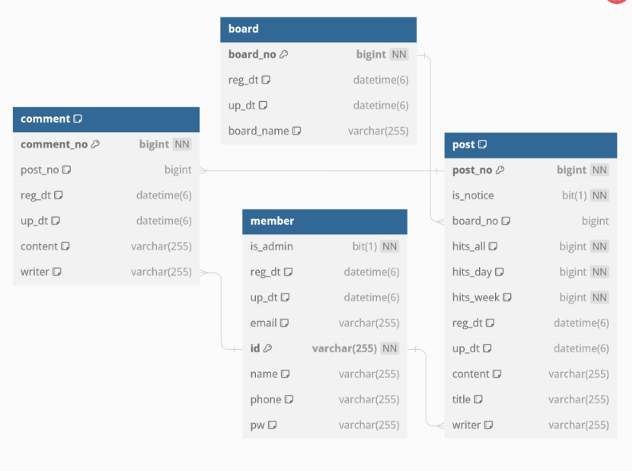

# community-project

## 개발 환경
* 스프링 부트 3.2.0   
* 자바 17

## 사용 기술
* jpa
* spring-security
* lombok
---

## 기능별 컨트롤러 분할   
로그인,회원정보 수정등 회원정보에 관한 내용 : MemberController   
게시판,게시글 crud에 관한 내용: BoardController   
관리자 권한으로 게시판,게시글 crud에 관한 내용 : AdminController   

## URL
/ : 비로그인시 member/login 으로 리다이렉트, 로그인돼있으면 board로 리다이렉트   
get-board/list : 게시판 목록 조회   
get-board/(게시판번호)?sort=(정렬방식) : 해당게시판의 게시글목록 조회. 등록순,일간 조회순, 주간 조회순 가능.
get-board/post/(게시글번호) : 게시글 내용 및 댓글 조회   
post-board/(게시판번호) : 게시글 작성   
patch-board/(게시글번호) :게시글 수정(본인만 가능)   
delete-board/(게시글번호) :게시글 삭제(본인만 가능)   
post-board/comment/(게시글번호):게시글에 댓글 입력   
patch-board/comment/(댓글번호):댓글 수정   
delete-board/comment/(댓글번호):댓글 삭제   

post-admin/board : 게시판 생성   
patch-admin/board : 게시판 수정   
delete-admin/board : 게시판 삭제   
post-admin/post : 게시글(공지사항) 생성   
patch-admin/post : 게시글 수정    
delete-admin/post : 규정에 어긋난 게시글 삭제   

post-member/signUp : 회원가입   
post-member/login : 로그인   
get-member/myPage: 내정보 조회   
patch-member/myPost: 내가 쓴 글 조회   
patch-member/myComment: 내가 쓴 댓글 조회   

## ERD

